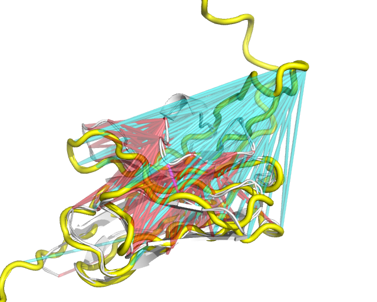
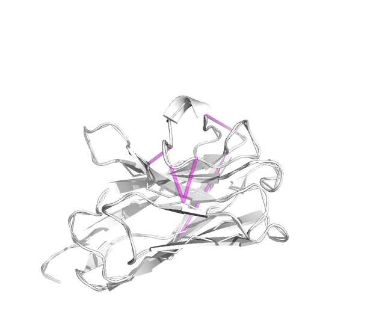
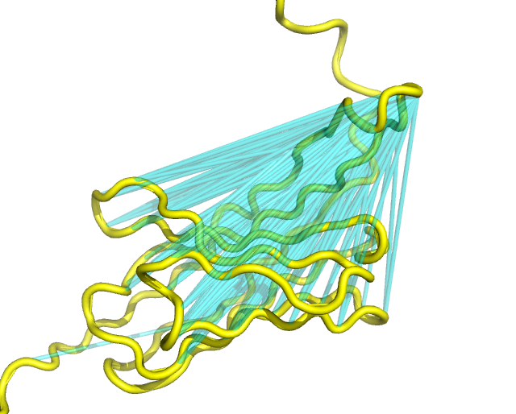
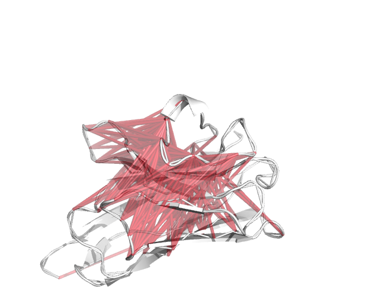

# Visualize Violations

This is a script for visualizing violated predictions in PyMol.



## Instructions

Since this requires a GUI, you will have to `scp` this folder onto your local computer, with a command like:

```
scp -r <username>@login.sherlock.stanford.edu:/oak/stanford/projects/pfold/visualize_violations ./
```

Then, place the following files into the `files` folder, where `<prot_id>` is the CAMEO ID e.g. `2020-02-29_000000219_2`.

- `<prot_id>.pdb` - This is the crystal structure's PDB
- `<prot_id>_ca.pdb` - This is the predicted CA trace's PDB, which can be found in the `cnd.files` folder under `output/{database}/{folder}/cnd.files/{prot_id}`, after running the PFOLD SDP+GD pipeline
- `<prot_id>.npz` / `<prot_id>_tf_std.npz` - This is the predicted distance matrix from step 3 of the PFOLD pipeline, which is can be found at `output/{database}/{folder}/npz.files/{prot_id}/{prot_id}_tf_std.npz`

Finally, run

```
pymol visualize_violations.py -- -p=<prot_id> -t=10
```

Note that we are running this with `pymol` and not `python`. Also note the `--` between the script and the flags.

More details about the flags:

- `--protein` / `-p` - The protein CAMEO ID e.g. `2020-02-29_000000219_2`
- `--threshold` / `-t` - Show only distance violations above this threshold (in Angstroms); defaults to 10

## Example

The `files` folder already contains sample files for `2020-02-29_000000219_2`, which can be viewed with 

```
pymol visualize_violations.py -- -p=2020-02-29_000000219_2
```



The white cartoon is the crystal structure, while the magenta lines highlight predicted distances that are off by more than 10A, compared to the crystal structure. Here we see that there are some violations around the loop.



The yellow cartoon is the predicted CA trace from SDP+GD, while the cyan lines highlight predicted distances that are off by more than 10A, compared to the CA trace. In other words, the predicted CA trace is unable to fulfill these distance constraints.

Here, we see most of the violations stemming from the residues in the loop on the right.



The red lines represent the previous violations (CA trace vs predicted distances), superimposed onto the crystal structure for clarity. This is especially useful when the predicted CA trace is messy.

Superimposing the previous violations onto the crystal, we see that the violations coincide with the wrongly predicted loop structure, which is straight in the predicted CA trace, but pinned down in the crystal structure.
